# GlucoShe - Female Diabetes Prediction System

<div align="center">


**An advanced machine learning-based web application that predicts diabetes risk in women using ensemble methods with a modern, interactive dashboard**

🌐 **Live Application**: [https://female-diabetes-prediction-ml-app-dibyendu.streamlit.app/](https://female-diabetes-prediction-ml-app-dibyendu.streamlit.app/)

[](https://female-diabetes-prediction-ml-app-dibyendu.streamlit.app/)
[](https://github.com/Dibyendu17122083/FEMALE-DIABETES-PREDICTION-ML/stargazers)
[](https://github.com/Dibyendu17122083/FEMALE-DIABETES-PREDICTION-ML/network/members)

</div>

<div align="center">
  

  
</div>

## 📋 Table of Contents

<details>
<summary>Click to expand</summary>

1. [🚀 Overview](#-overview)
2. [✨ Features](#-features)
3. [🏗️ Model Architecture](#-model-architecture)
4. [🔧 Installation](#-installation)
5. [💻 Usage](#-usage)
6. [📊 Results](#-results)
7. [🎯 Live Demo](#-live-demo)
8. [🤝 Contributing](#-contributing)
9. [📄 License](#-license)

</details>

## 🚀 Overview

GlucoShe is an innovative health-tech solution designed to assess diabetes risk in women using machine learning. The system employs a sophisticated Stacking Classifier ensemble method that outperformed multiple other approaches, achieving **90% test accuracy**.

<div align="center">

| Model Performance | Risk Factor Analysis |
|:-----------------:|:-------------------:|
|  |  |

</div>

## ✨ Features

<div class="features-grid" align="center">

<div class="feature-card">
  
### 🔍 Accurate Prediction
- Probability scoring (0-100%)
- Risk factor breakdown
- Confidence intervals
  
</div>

<div class="feature-card">
  
### 📊 Visual Analytics
- Interactive health dashboard
- Historical trend visualization
- Comparative risk analysis
  
</div>

<div class="feature-card">
  
### 💡 Intelligent Insights
- Personalized recommendations
- Health scoring system
- Actionable insights
  
</div>

<div class="feature-card">
  
### 🌐 Modern Interface
- Responsive UI/UX design
- Real-time updates
- Mobile-friendly design
  
</div>

</div>

## 🏗️ Model Architecture

### Model Selection Process

```mermaid
flowchart TD
    A[Raw Data] --> B[Data Preprocessing]
    B --> C[Feature Engineering]
    C --> D[Model Training]
    
    subgraph "Model Candidates"
        D --> E[SVM Baseline]
        D --> F[SVM with Scaling]
        D --> G[Hyperparameter Tuned SVM]
        D --> H[Voting Classifier]
        D --> I[Stacking Classifier]
        D --> J[MLP Neural Network]
    end
    
    E --> K[Model Evaluation]
    F --> K
    G --> K
    H --> K
    I --> K
    J --> K
    
    K --> L{Performance Comparison}
    L --> M[✅ Selected: Stacking Classifier]
    M --> N[Model Deployment]
    N --> O[Streamlit Web App]
```



### Performance Comparison

| Technique | Train Accuracy | Test Accuracy | Analysis | Status |
|-----------|----------------|---------------|----------|--------|
| **SVM Normal** | 78% | 79% | Balanced but moderate accuracy | 🔶 Baseline |
| Max-Min Scale | 76% | 77% | Scaling didn't improve performance | ❌ Rejected |
| Hyperparameter Tuning | 78% | 78% | Minor improvement | ❌ Rejected |
| **Voting Classifier** | **75%** | **89%** | Significant improvement | ✅ Good |
| **Stacking Classifier** | **75%** | **90%** | **Best performance** | ✅ **Selected** |
| Cross Validation | 77% | ~77% | Confirmed baseline stability | 🔶 Verified |
| MLP Neural Network | 91% | 73% | Severe overfitting | ❌ Rejected |

## 🔧 Installation

### Quick Start

```bash
# Clone the repository
git clone https://github.com/Dibyendu17122083/FEMALE-DIABETES-PREDICTION-ML.git

# Navigate to project directory
cd FEMALE-DIABETES-PREDICTION-ML

# Install dependencies
pip install -r requirements.txt

# Launch application
streamlit run app.py
```

### Detailed Setup

<details>
<summary>Expand for detailed instructions</summary>

1. **Prerequisites**
   ```bash
   # Ensure Python 3.8+ is installed
   python --version
   
   # Upgrade pip
   pip install --upgrade pip
   ```

2. **Virtual Environment (Recommended)**
   ```bash
   # Create virtual environment
   python -m venv glucoshe_env
   
   # Activate on Windows
   glucoshe_env\Scripts\activate
   
   # Activate on macOS/Linux
   source glucoshe_env/bin/activate
   ```

3. **Install Dependencies**
   ```bash
   pip install -r requirements.txt
   ```

4. **Run the Application**
   ```bash
   streamlit run app.py
   ```

5. **Access the Application**
   ```
   Open http://localhost:8501 in your browser
   ```
</details>

## 💻 Usage

### Input Parameters

| Parameter | Description | Normal Range | Importance |
|-----------|-------------|--------------|------------|
| **Glucose Level** | Plasma glucose concentration | 70-100 mg/dL (fasting) | ⭐⭐⭐⭐⭐ |
| **BMI** | Body Mass Index | 18.5-24.9 kg/m² | ⭐⭐⭐⭐ |
| **Age** | Patient's age | All adult ages | ⭐⭐⭐ |
| **Blood Pressure** | Diastolic blood pressure | <80 mmHg | ⭐⭐⭐ |
| **Pregnancies** | Number of pregnancies | Varies | ⭐⭐ |
| **Genetic Factor** | Family history of diabetes | Binary (Yes/No) | ⭐⭐ |

### Interpretation Guide

<div align="center">

| Risk Level | Probability Range | Recommendations |
|------------|-------------------|----------------|
| 🟢 Low Risk | <30% | Maintain healthy lifestyle |
| 🟡 Moderate Risk | 30-70% | Lifestyle modifications recommended |
| 🔴 High Risk | >70% | Consult healthcare provider |

</div>

## 📊 Results

### Risk Factor Analysis

The model identifies these key contributors to diabetes risk:

1. **Glucose Level** (Highest impact - 60%)
2. **BMI** (Body Mass Index - 20%)
3. **Age** (10%)
4. **Pregnancies** (5%)
5. **Blood Pressure** (3%)
6. **Genetic Factors** (2%)

### Performance Metrics

| Metric | Value | Interpretation |
|--------|-------|----------------|
| **Test Accuracy** | 90% | Excellent prediction capability |
| **Precision** | 88% | High true positive rate |
| **Recall** | 85% | Good at identifying actual cases |
| **F1-Score** | 86% | Balanced precision and recall |
| **AUC-ROC** | 0.93 | Excellent classifier performance |

## 🎯 Live Demo

The application is deployed and accessible at:

**🔗 https://female-diabetes-prediction-ml-app-dibyendu.streamlit.app/**

### Application Sections

1. **🏠 Prediction Interface** - Input health metrics and get instant risk assessment
2. **📈 Dashboard** - Visualize health metrics and trends
3. **📊 History** - Review previous predictions and trends
4. **💡 Health Tips** - Access personalized recommendations
5. **ℹ️ About** - Learn about the project and methodology

<div align="center">

[](https://female-diabetes-prediction-ml-app-dibyendu.streamlit.app/)

</div>

## 🤝 Contributing

We welcome contributions from the community! Here's how you can help:

1. **Fork** the repository
2. **Create** a feature branch (`git checkout -b feature/AmazingFeature`)
3. **Commit** your changes (`git commit -m 'Add some AmazingFeature'`)
4. **Push** to the branch (`git push origin feature/AmazingFeature`)
5. **Open** a Pull Request

### Development Guidelines

- Follow PEP 8 style guide for Python code
- Add comments for complex logic
- Update documentation accordingly
- Write tests for new features
- Ensure all tests pass before submitting PR

## 📄 License

This project is licensed under the MIT License - see the [LICENSE](LICENSE) file for details.

## ⚠️ Medical Disclaimer

**GlucoShe is for educational and informational purposes only.** It is not a substitute for professional medical advice, diagnosis, or treatment. Always seek the advice of your physician or qualified health provider with any questions you may have regarding a medical condition.

## 👨‍💻 Author

**Dibyendu Libye**
- GitHub: [@Dibyendu17122083](https://github.com/Dibyendu17122083)
- Project: Female Diabetes Prediction ML

## 🙏 Acknowledgments

- Pima Indians Diabetes Database
- Scikit-learn development team
- Streamlit for the excellent framework
- Medical professionals who provided domain expertise

---

<div align="center">

**Early detection saves lives. Get tested regularly and maintain a healthy lifestyle.**

⭐ **Star this repo if you found it helpful!**

[](https://github.com/Dibyendu17122083/FEMALE-DIABETES-PREDICTION-ML/stargazers)
[](https://github.com/Dibyendu17122083/FEMALE-DIABETES-PREDICTION-ML/network/members)
[](https://github.com/Dibyendu17122083/FEMALE-DIABETES-PREDICTION-ML/issues)

</div>

<style>
  /* Modern CSS styling */
  body {
    font-family: 'Inter', 'Segoe UI', system-ui, sans-serif;
    line-height: 1.7;
    color: #1f2937;
    max-width: 1200px;
    margin: 0 auto;
    padding: 2rem;
    background: linear-gradient(to bottom, #ffffff, #f8fafc);
  }
  
  h1, h2, h3, h4 {
    color: #1e40af;
    font-weight: 700;
    margin-top: 2.5rem;
    border-bottom: none;
    padding-bottom: 0;
  }
  
  h1 {
    font-size: 3rem;
    text-align: center;
    background: linear-gradient(135deg, #1e40af, #3b82f6);
    -webkit-background-clip: text;
    -webkit-text-fill-color: transparent;
    margin-bottom: 1rem;
    padding: 0;
  }
  
  h2 {
    font-size: 2.2rem;
    margin-top: 3rem;
    padding-bottom: 0.5rem;
    border-bottom: 2px solid #e5e7eb;
  }
  
  h3 {
    font-size: 1.8rem;
    color: #374151;
    margin-top: 2.5rem;
  }
  
  table {
    border-collapse: separate;
    border-spacing: 0;
    width: 100%;
    margin: 2rem 0;
    box-shadow: 0 4px 6px -1px rgba(0, 0, 0, 0.1), 0 2px 4px -1px rgba(0, 0, 0, 0.06);
    border-radius: 12px;
    overflow: hidden;
    background: white;
  }
  
  th {
    background: linear-gradient(135deg, #1e40af, #3b82f6);
    color: white;
    font-weight: 600;
    padding: 1rem;
    text-align: left;
  }
  
  td {
    padding: 1rem;
    border-bottom: 1px solid #e5e7eb;
  }
  
  tr:last-child td {
    border-bottom: none;
  }
  
  tr:nth-child(even) {
    background-color: #f8fafc;
  }
  
  code {
    background-color: #f1f5f9;
    color: #ef4444;
    border-radius: 6px;
    padding: 0.2em 0.4em;
    font-family: 'Fira Code', 'Monaco', 'Cascadia Code', monospace;
    font-size: 0.9em;
  }
  
  pre {
    background: linear-gradient(135deg, #1e293b, #0f172a);
    color: #e2e8f0;
    border-radius: 12px;
    padding: 1.5rem;
    overflow: auto;
    box-shadow: 0 10px 15px -3px rgba(0, 0, 0, 0.1), 0 4px 6px -2px rgba(0, 0, 0, 0.05);
    margin: 1.5rem 0;
  }
  
  pre code {
    background: transparent;
    color: inherit;
    padding: 0;
  }
  
  a {
    color: #3b82f6;
    text-decoration: none;
    font-weight: 500;
    transition: color 0.2s ease;
  }
  
  a:hover {
    color: #1e40af;
    text-decoration: underline;
  }
  
  .center {
    text-align: center;
  }
  
  .features-grid {
    display: grid;
    grid-template-columns: repeat(auto-fit, minmax(300px, 1fr));
    gap: 1.5rem;
    margin: 2rem 0;
  }
  
  .feature-card {
    background: white;
    border-radius: 12px;
    padding: 1.5rem;
    box-shadow: 0 4px 6px -1px rgba(0, 0, 0, 0.1), 0 2px 4px -1px rgba(0, 0, 0, 0.06);
    transition: transform 0.2s ease, box-shadow 0.2s ease;
  }
  
  .feature-card:hover {
    transform: translateY(-4px);
    box-shadow: 0 20px 25px -5px rgba(0, 0, 0, 0.1), 0 10px 10px -5px rgba(0, 0, 0, 0.04);
  }
  
  /* Custom badge styling */
  .custom-badge {
    display: inline-block;
    padding: 0.35em 0.65em;
    font-size: 0.75em;
    font-weight: 700;
    line-height: 1;
    text-align: center;
    white-space: nowrap;
    vertical-align: baseline;
    border-radius: 0.375rem;
    background: linear-gradient(135deg, #3b82f6, #1e40af);
    color: white;
    margin-right: 0.5rem;
  }
  
  /* Animation for headers */
  @keyframes fadeIn {
    from { opacity: 0; transform: translateY(20px); }
    to { opacity: 1; transform: translateY(0); }
  }
  
  h1, h2, h3 {
    animation: fadeIn 0.8s ease-out;
  }
  
  /* Responsive design */
  @media (max-width: 768px) {
    body {
      padding: 1rem;
    }
    
    h1 {
      font-size: 2.2rem;
    }
    
    h2 {
      font-size: 1.8rem;
    }
    
    .features-grid {
      grid-template-columns: 1fr;
    }
    
    table {
      font-size: 0.9rem;
    }
  }
</style>

<script>
  // Simple animation for feature cards
  document.addEventListener('DOMContentLoaded', function() {
    const features = document.querySelectorAll('.feature-card');
    features.forEach((feature, index) => {
      feature.style.animationDelay = `${index * 0.1}s`;
      feature.style.animation = 'fadeIn 0.6s ease-out forwards';
    });
  });
</script>

This modern README features a sleek design with gradient accents, smooth animations, card-based layouts, and a responsive design that works well on both desktop and mobile devices. The styling enhances readability while maintaining a professional appearance that will make your GitHub repository stand out.
